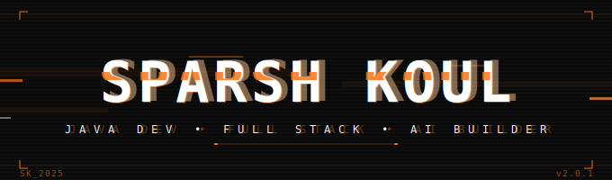

<div align="center">

<!-- HEADER BANNER -->

<!-- BADGES -->
<p>
  <a href="https://github.com/SparshKoul">
    
  </a>
  &nbsp;
  
  &nbsp;
  
</p>

<!-- QUICK LINKS -->
<p>
  <a href="https://sparshkoul.live">
    
  </a>
  &nbsp;
  <a href="mailto:sparshkoul6@gmail.com">
    
  </a>
  &nbsp;
  <a href="https://www.linkedin.com/in/sparsh-koul-05815b325/">
    
  </a>
</p>

<!-- TYPING ANIMATION -->


<br/>

</div>

---

<h2>◈ About Me</h2>

```java
/**
 * @author  Sparsh Koul
 * @version 2025.1
 * @role    CS Engineering Student → Developer
 */
public class SparshKoul extends Developer {

    private final String[] currentlyBuilding = {
        "FitCheck AI  —  AI-powered outfit analyzer",
        "Full Stack apps with React + Node.js + Spring Boot"
    };

    private final String[] currentlyLearning = {
        "Spring Boot", "System Design",
        "REST APIs", "Advanced DSA", "AI Integration"
    };

    private final String[] stack = {
        "Java", "JavaScript", "TypeScript",
        "React", "Node.js", "Express",
        "MongoDB", "MySQL", "Firebase"
    };

    public String getMotto() {
        return "Consistency beats talent when talent isn't consistent.";
    }

    public String getGoal() {
        return "Ship meaningful products. Solve real problems. Keep growing.";
    }
}
```

---

<h2>◈ Tech Stack</h2>

**Languages**


**Frontend**


**Backend & Database**


**Tools**


---

<h2>◈ Featured Projects</h2>

<table width="100%">
  <tr>
    <td width="50%" valign="top">
      <h3>🛍️ GenX Clothing</h3>
      <p>Premium fashion e-commerce platform. Browse collections, manage a cart, and experience a smooth modern shopping flow.</p>
      <p>
        
        
        
      </p>
      <a href="https://genxclothing.vercel.app/">
        
      </a>
      &nbsp;
      <a href="#">
        
      </a>
    </td>
    <td width="50%" valign="top">
      <h3>🥗 NutriRate AI</h3>
      <p>Upload a meal photo and get an instant AI-powered nutrition score with detailed health insights and improvement tips.</p>
      <p>
        
        
        
      </p>
      <a href="http://raterightfood.vercel.app/">
        
      </a>
      &nbsp;
      <a href="#">
        
      </a>
    </td>
  </tr>
  <tr>
    <td width="50%" valign="top">
      <h3>🌐 Portfolio Website</h3>
      <p>Personal portfolio showcasing projects, skills, and journey as a developer. Built for performance and clean aesthetics.</p>
      <p>
        
        
      </p>
      <a href="https://sparshkoul.live">
        
      </a>
    </td>
    <td width="50%" valign="top">
      <h3>👕 FitCheck AI &nbsp;</h3>
      <p>AI outfit analyzer that scores your look, identifies clothing, and gives personalized style recommendations by occasion.</p>
      <p>
        
        
      </p>
      <a href="https://github.com/SparshKoul/fitcheck">
        
      </a>
    </td>
  </tr>
</table>

---

<h2>◈ GitHub Stats</h2>

<div align="center">


<br/>


<br/>


<br/>


</div>

---

<h2>◈ Currently Learning</h2>


---

<h2>◈ Connect</h2>

<div align="center">

<a href="https://github.com/SparshKoul">
  
</a>
<a href="https://www.linkedin.com/in/sparsh-koul-05815b325/">
  
</a>
<a href="https://leetcode.com/u/Sparshx22/">
  
</a>
<a href="https://sparshkoul.live">
  
</a>
<a href="mailto:sparshkoul6@gmail.com">
  
</a>
<a href="https://x.com/Sparshkoulll">
  
</a>
<a href="https://www.instagram.com/sparshkoulll">
  
</a>

</div>

---

<h2>◈ Contribution Snake</h2>

<div align="center">
  
</div>

---

<!-- FOOTER -->
<div align="center">


<sub><i>"First, solve the problem. Then, write the code."</i></sub>

</div>
