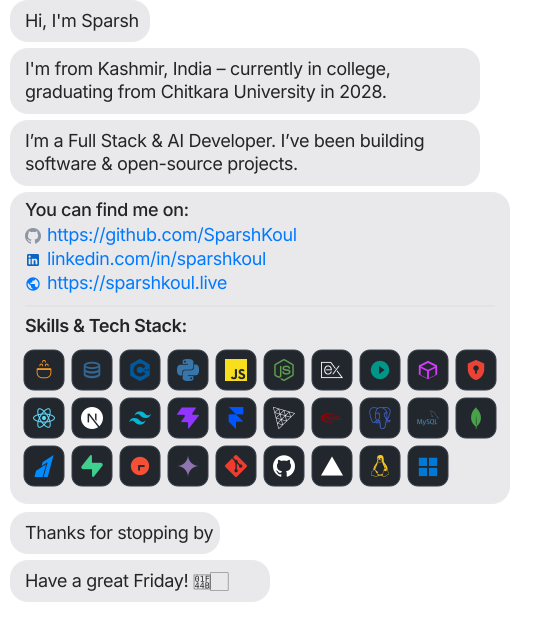

<div align="center">
  <!-- Interactive Profile Chat SVG -->
  <a href="https://github.com/SparshKoul">
    
  </a>

  <br/><br/>

  <!-- Status & Quick Badges -->
  <p align="center">
    
    
    
  </p>

  <!-- Connect Social Buttons -->
  <p align="center">
    <a href="https://sparshkoul.live"></a>
    <a href="https://www.linkedin.com/in/sparshkoul"></a>
    <a href="https://github.com/SparshKoul"></a>
    <a href="https://leetcode.com/u/sparshkoul/"></a>
    <a href="mailto:sparshkoul6@gmail.com"></a>
    <a href="https://x.com/Sparshkoulll"></a>
  </p>
</div>

<br/>

---

### ⚡ About Me

```yaml
Name: Sparsh Koul
Role: Full-Stack & AI Developer
Education: Computer Science Student @ Chitkara University (Class of 2028)
Currently Building: 
  - WYD 📹  →  Video chatting platform specifically designed for college students
  - FitCheck AI 👕  →  AI-powered outfit & style analyzer
  - Full-Stack Web Applications  →  React + Node.js + Spring Boot
Currently Learning: System Design, WebRTC, Advanced DSA, Spring Boot, AI Integrations
Core Focus: Building scalable real-time web applications & integrating AI/ML workflows
```

<br/>

### 🛠️ Tech Stack & Complete Skillset

<div align="center">

**`// LANGUAGES`**  
<p>
  
</p>

**`// BACKEND`**  
<p>
  
</p>

**`// FRONTEND`**  
<p>
  
</p>

**`// DATABASES`**  
<p>
  
</p>

**`// TOOLS & PLATFORMS`**  
<p>
  
</p>

**`// OS`**  
<p>
  
</p>

</div>

<br/>

---

### 🚀 Deployed & Active Projects

<table width="100%">
  <tr>
    <td width="50%" valign="top" align="center">
      <br/>
      
      <br/><br/>
      
      <br/><br/>
      <p align="left">
        <b>Video Chatting Platform for College Students</b><br/>
        A real-time video chat &amp; social platform designed specifically for college students to connect, hang out, and collaborate seamlessly.
      </p>
      <p align="center">
        
      </p>
      <br/>
      <a href="https://github.com/SparshKoul">
        
      </a>
      <br/><br/>
    </td>
    <td width="50%" valign="top" align="center">
      <br/>
      
      <br/><br/>
      
      <br/><br/>
      <p align="left">
        <b>Next-Gen Fashion E-Commerce Platform</b><br/>
        Full-featured online fashion store featuring dynamic product catalog, interactive cart management, and seamless checkout experience.
      </p>
      <p align="center">
        
      </p>
      <br/>
      <a href="https://genxclothing.vercel.app/">
        
      </a>
      &nbsp;
      <a href="https://github.com/SparshKoul/E-commerce">
        
      </a>
      <br/><br/>
    </td>
  </tr>
  <tr>
    <td width="50%" valign="top" align="center">
      <br/>
      
      <br/><br/>
      
      <br/><br/>
      <p align="left">
        <b>AI Food &amp; Macro Analyzer</b><br/>
        Smart nutrition scanner providing instant AI food scoring, detailed macro breakdowns, and personalized dietary advice.
      </p>
      <p align="center">
        
      </p>
      <br/>
      <a href="http://raterightfood.vercel.app/">
        
      </a>
      &nbsp;
      <a href="https://github.com/SparshKoul/RateRight">
        
      </a>
      <br/><br/>
    </td>
    <td width="50%" valign="top" align="center">
      <br/>
      
      <br/><br/>
      
      <br/><br/>
      <p align="left">
        <b>AI Outfit Scorer &amp; Style Advisor</b><br/>
        Intelligent outfit analyzer evaluating clothing items, color coordination, and giving occasion-based style recommendations.
      </p>
      <p align="center">
        
      </p>
      <br/>
      <a href="https://github.com/SparshKoul/fitcheck">
        
      </a>
      <br/><br/>
    </td>
  </tr>
</table>

<br/>

---

### 📊 GitHub System Metrics

<div align="center">
  
  
</div>

<br/>

<div align="center">
  
</div>

<br/>

<div align="center">
  
</div>

<br/>

---

<div align="center">
  <sub><i>"First, solve the problem. Then, write the code."</i></sub>
</div>
